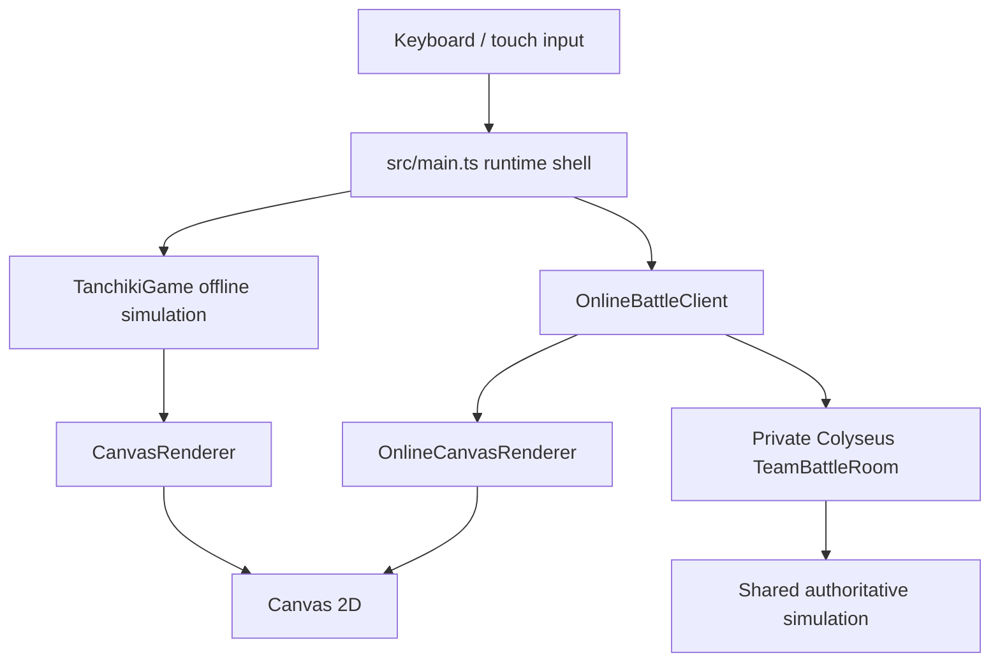

# Tanchiki2

**Тактическая игра о действии внутри неопределённости.**

> Tanchiki2 is a browser-first tactical tank game about turning incomplete information into coordinated action.

Tanchiki2 переосмысляет классические игры о танках с видом сверху. Здесь важны не только стрельба и уничтожение противника, но и разведка, интерпретация следов, управление связью, ограниченными боеприпасами и последствиями собственных решений.

Поле боя скрыто туманом войны и не сообщает игроку готовую истину. Враг может быть виден напрямую, замечен несколько секунд назад, услышан, восстановлен по следам или спутан с ложным контактом. Поэтому основной цикл игры выглядит так:

> **наблюдение → предположение → коммуникация → действие → оставленный след → новое толкование ситуации**

## Идея игры

Главный противник Tanchiki2 — **неполнота знания**.

Игра строится вокруг четырёх принципов:

- **Информация является ресурсом.** Зрение, шум, следы, пинги, ретрансляторы и последние известные позиции имеют собственную тактическую ценность.
- **Карта помнит.** Поверхности сохраняют или скрывают следы, искажают звук, показывают разрушение и участвуют в производстве знания о противнике.
- **Каждое преимущество имеет цену.** Ускорение делает след заметнее, новый мост помогает обеим сторонам, EMP нарушает информационную систему всего локального поля.
- **Неопределённость остаётся честной.** Правила детерминированы и тестируемы; AI не должен видеть сквозь туман войны, а наказание должно иметь читаемую причину.

Краткая формула проекта:

> **Туман заставляет сомневаться; цель заставляет действовать.**

Tanchiki2 развивается как кооперативная тактическая игра. Текущий `main` уже содержит играбельную offline-кампанию из десяти миссий, включая Echo Quarry и Signal Scar, союзных ботов в командных режимах и локальный server-authoritative online-прототип, но production multiplayer пока не развёрнут.

## Что уже реализовано

### Кампания и цели

- 10 вручную собранных campaign-уровней;
- крупные карты с камерой, разрушаемыми объектами и разными маршрутами;
- пять режимов: **Defense**, **Team Battle**, **Capture the Flag**, **Free for All** и **Assault**;
- локальные сохранения, продолжение забега, открытие и повторное прохождение миссий;
- **Tactical Evaluation**, оценивающая не только победу, но и точность, сохранность объектов, разрушения, потери союзников и качество выполнения задачи.

### Классы танков

Классы задают способы действия в неизвестности, а не линейные уровни силы.

| Класс | Доктрина | Основные особенности |
|---|---|---|
| **Scout** | знать раньше, чем вступать в бой | быстрое движение, лёгкие снаряды, decoy, tripwire, один переносной ретранслятор |
| **Engineer** | менять условия боя | сбалансированное движение, мины, стальные ловушки, два переносных ретранслятора |
| **Battle Tank** | держать тяжёлую огневую линию | тяжёлый splash-снаряд, активный Bulwark на 5 секунд, четырёхсекундный боковой Traverse, один ретранслятор |

### Major Mods

Перед миссией выбирается один мод, меняющий доступную тактику без постоянного RPG-усиления характеристик.

| Мод | Возможность | Цена или контр-игра |
|---|---|---|
| **Overdrive** | временное ускорение | более заметные и долговечные следы, cooldown |
| **Pontoon Bridge** | маршрут через воду | мост доступен обеим сторонам |
| **Czech Hedgehog** | контроль и блокирование прохода | устройство уничтожаемо и опасно при плохом размещении |
| **EMP Emitter** | локальное подавление ретрансляторов | нарушает сигнальную инфраструктуру обеих сторон |

### Разведка и поле боя

- круговой туман войны и ограниченные last-known contacts;
- стационарные и переносные ретрансляторы;
- командное зрение, зависящее от владения ретранслятором;
- ограниченный боекомплект и ammo stations;
- единый deployable engine для decoy, mine, noise, steel trap и tripwire; текущие class loadouts открывают только часть этих устройств, а noise остаётся prototype path;
- детерминированный AI: perception, belief memory, utility scoring, weighted pathfinding и fire control;
- atlas-backed pixel-art props с процедурным fallback;
- high-contrast Canvas 2D renderer, fog-safe minimap, touch controls, SFX и color-safe mode;
- иллюстрированная внутриигровая Encyclopedia.

### Экспериментальные системы

В скрытых test/dev-картах проверяются системы, которые ещё не полностью встроены в основную кампанию:

- swamp, snow, dust road, gravel и metal floor;
- детерминированный ricochet;
- echo corridors и нейтральные звуковые волны;
- расширенная taxonomy биомов и battlefield props;
- soft-cover растительность: скрытность неподвижного танка, rustle при движении и раскрытие после выстрела;
- disturbance и evidence, оставляемые танками на разных поверхностях.

Этот порядок намеренный: новая категория механик сначала получает сериализуемый контракт, тесты и отдельную QA-карту, а уже затем становится частью campaign content.

## Управление

| Действие | Клавиши |
|---|---|
| Движение и поворот | `WASD` или стрелки |
| Выстрел | `Space` |
| Установить или вернуть переносной ретранслятор | удерживать `E` |
| Активировать Major Mod | `X` |
| Классовое оборудование | `1` и `2` — две способности выбранного класса |
| Пауза | `P` |
| Назад / закрыть меню | `Esc` |

Для устройств с установкой используется удержание клавиши. На устройствах с coarse pointer доступны экранные touch controls.

## Технологический стек

- TypeScript и Vite;
- Canvas 2D с собственным update/render loop;
- Vitest и Playwright;
- Node.js 22 для локального authoritative multiplayer server;
- self-hosted Colyseus 0.17 WebSockets для private room lifecycle, messages и reconnection;
- Figma/atlas-based sprite pipeline с процедурным fallback;
- локальные browser saves через `localStorage`;
- Agentic Harness для пакетной валидации, review gates и воспроизводимых evidence artifacts.

## Архитектура



### Offline

`src/game/game.ts` содержит orchestration root offline-режима: уровень, танки, снаряды, цели, fog, relays, deployables, mods, evidence, AI, rewards и save state.

Правила и решения постепенно вынесены в отдельные модули:

- `src/game/terrain.ts` — каталог поверхностей и их механические свойства;
- `src/game/tankClasses.ts` — идентичность и оборудование классов;
- `src/game/tacticalEvaluation.ts` — интерпретация качества победы;
- `src/game/battlefieldProps.ts` и `softCoverVegetation.ts` — props и укрытия;
- `src/game/ai/` — perception, beliefs, utility, behavior, pathfinding и fire control;
- `src/game/save.ts` — нормализация и хранение сохранений;
- `src/game/render.ts` — offline Canvas renderer;
- `src/game/types.ts` — сериализуемые контракты состояния и snapshots.

Для QA runtime предоставляет детерминированное продвижение симуляции и текстовый snapshot через `window.advanceTime(ms)` и `window.render_game_to_text()`.

### Online

`packages/shared/src/multiplayer.ts` содержит authoritative match state, движение, снаряды, relays, фиксированные team-radio команды, team pings, vision memory и создание отдельного snapshot для каждого игрока.

`packages/server/server.mjs` запускает локальный self-hosted Colyseus server:

- один игрок создаёт private room и передаёт host-only шестизначный key;
- до четырёх игроков выбирают Blue/Red, Ready и запускают равные 1v1 или 2v2 teams;
- lobby control, gameplay commands, personalized snapshots, heartbeats, results и reconnection идут через Colyseus WebSocket;
- после результата все игроки могут единогласно запросить rematch с тем же roster и новым room key;
- произвольный chat отключён; коммуникация ограничена пятью фиксированными team-radio командами и team pings;
- скрытые клетки, игроки, снаряды, relays и pings фильтруются на сервере;
- клиент интерполирует историю snapshots, не получая запрещённого fog-of-war знания.

Room disposable и unlisted. В MVP нет public matchmaking, database, accounts, Redis, Supabase, Colyseus Cloud или production deployment. HTTP остаётся только для health и bounded key-to-room resolution; legacy HTTP-command/SSE gameplay transport удалён.

## Структура репозитория

```text
src/game/               offline simulation, AI, rendering, terrain and saves
src/online/             online client, interpolation, input, camera and minimap
packages/shared/        authoritative multiplayer rules and contracts
packages/server/        private Colyseus room, lifecycle controller and key registry
public/assets/sprites/  runtime sprite atlases
qa/playwright/          browser and visual smoke checks
docs/                   design, mechanics, planning and release evidence
.agentic-harness/       governed validation and review adapter
```

## Локальный запуск

Требуется Node.js 22 и npm.

```bash
npm ci
npm run dev
```

Vite выведет локальный URL клиента в терминал.

Для локальной проверки всех десяти миссий откройте URL Vite с параметром
`?campaign=all`, например `http://127.0.0.1:5173/?campaign=all`. Этот режим
работает только в dev-сборке, использует временное сохранение в памяти и не
изменяет обычный прогресс кампании.

### Локальный online-прототип

Запустите сервер и клиент в отдельных терминалах:

```bash
npm run server:dev
```

```bash
npm run dev
```

По умолчанию клиент подключается к `http://127.0.0.1:8787`. Другой адрес можно передать через `VITE_MULTIPLAYER_URL`.

Откройте **Online Battle**, затем **Create Room** или **Join By Key**. Production обязан задать `ALLOWED_ORIGIN`, завершать TLS перед сервером и предоставлять Colyseus через `wss`; local development намеренно использует `ws`.

Неактивирующий production Blueprint находится в `render.yaml`, а выбранная архитектура, стоимость, health/monitoring, smoke и rollback описаны в `docs/deployment/tanchiki2-production-multiplayer-hosting-readiness-v1.md`. Само наличие этих файлов не разрешает provisioning или deployment: production startup fail-fast требует точный HTTPS `ALLOWED_ORIGIN`, а Render auto-deploy намеренно выключен.

### Production build

```bash
npm run build
npm run preview
```

## Проверки

```bash
npm run test
npm run build
npm run server:smoke
npm run online:lab:quick
npm run online:browser:four-context
npm run bundle:profile
npm run visual:f3-runtime-boundary
npm run visual:contrast
npm run validate
```

`npm run validate` объединяет unit tests, production build, server smoke и проверки Agentic Harness. GitHub Actions запускает этот gate для pull requests и изменений `main`.

## Архитектурные инварианты

Дальнейшая разработка придерживается нескольких правил:

1. механика должна создавать новый способ думать, а не только новый бонус;
2. преимущество должно иметь цену или контр-игру;
3. причина результата должна быть читаема игроком;
4. AI и клиент не получают запрещённого знания;
5. состояние и правила остаются явными, сериализуемыми и детерминированными;
6. renderer отображает состояние, но не принимает игровые решения;
7. core rules не должны вручную расходиться между offline и online;
8. новая система сначала получает test/dev map и regression coverage;
9. визуальные эффекты подчиняются информационной иерархии;
10. центральное переживание остаётся прежним: осторожное коллективное действие в неизвестности.

## Текущее направление

Signal Scar теперь служит основным vertical slice: он объединяет fog, ограниченные боеприпасы, soft cover, tracks, decoys, классы, jammer/EMP и objective pressure. Следующий этап — стабилизировать и ясно представить уже собранную игру:

1. сохранять единый спокойный gameplay surface на desktop и tablet;
2. исправлять конкретные проблемы читаемости, accessibility и player-facing copy без нового UI chrome;
3. постепенно выносить крупные runtime systems из растущих orchestration-модулей;
4. удерживать offline и authoritative online mechanics на общих правилах;
5. отдельно проверить локальный hearing range, не смешивая обычный звук с relay/radar intelligence;
6. только после стабилизации правил расширять content tooling, production art, networking и cloud persistence.

## Известные ограничения

- production multiplayer backend пока не развёрнут;
- human WAN acceptance ещё требует реальных участников и сетей;
- shared class-механики offline/online выровнены, но Major Mods, portable relays, persistent Garage loadouts и большая часть campaign content остаются offline-only;
- часть terrain/prop vocabulary существует только на test/dev-картах;
- обычные battlefield sounds пока слышны дальше, чем предполагает будущая spatial hearing model; relay/radar cues должны остаться отдельным информационным каналом;
- `TanchikiGame` и offline renderer остаются крупными orchestration-модулями;
- repository пока находится в стадии feature-rich prototype / vertical-slice development, а не завершённого релиза.

## Проектная формулировка

> **Tanchiki2 — кооперативная тактическая игра о действии внутри неопределённости. Игроки используют разведку, ограниченные боеприпасы, ретрансляторы, ловушки, декои, следы окружения и несовершенную коммуникацию, чтобы превращать неполное знание в согласованное действие. Каждый сигнал помогает, но каждый сигнал может раскрыть, обмануть или подвергнуть команду опасности. Поле боя не является нейтральной ареной: оно помнит движение, искажает звук, сохраняет разрушение и участвует в производстве знания.**

---

Проект вдохновлён классическими top-down tank games и пространственной логикой звука и неопределённости, но развивается как самостоятельная тактическая система.
